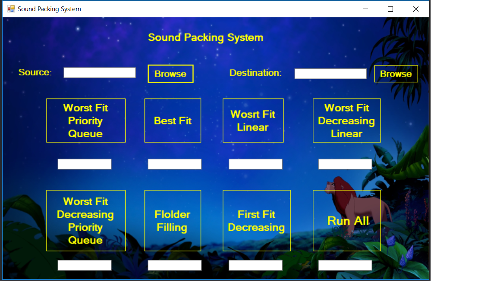

<html>

## Sound-Packing-system

 Sound-Packing-system is a system that helps you to organize ur sound files Depending on their duration.

some instructions:
put ur sound files in one folder and a metadata file with them describes ur files like "audiosInfo.txt" file and  another file describes the max time u want for each folder like "readme.txt" then put this folder in the Source .

## Running Sample For the Program

</html>
